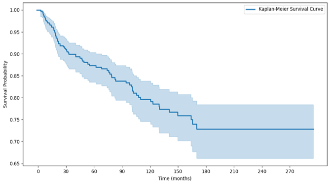

# Employee Turnover Insights: Using Survival Analysis

## Project Overview
The analysis encompassed a review of historical turnover trends, departmental and job band-specific attrition rates, and factors related to employee tenure. I employed predictive analytics derived from the Employee Engagement Survey and integrated direct feedback from former employees. Additionally, the analysis incorporated bivariate analyses and advanced statistical techniques, including Survival Analysis utilizing the Kaplan-Meier estimator and the Cox proportional hazards model.

### Methodologies Used:

- **Predictive Analytics:** Analyzed survey data to forecast turnover trends.
- **Survival Analysis:** Applied Kaplan-Meier estimator and COX proportional hazards model to understand temporal patterns and predictors of turnover.

### Description of Methodolies
- **Survival Analysis:** A statistical method for analyzing and interpreting the time until an event of interest occurs, such as the duration an employee remains with a company before leaving.
- **Kaplan-Meier Estimator:** A non-parametric statistic used in survival analysis to estimate the survival function. It helps visualize the probability of employees remaining with the company over time, often depicted as a survival curve.
- **Cox Proportional Hazards Model:** A regression model used in survival analysis to explore the relationship between the time until an event occurs (such as an employee leaving) and one or more predictor variables. It assumes that the effect of these predictors is multiplicative and proportional over time.

These methodologies can help identify **high-risk groups** by analyzing survival curves. This allows you to determine which employee groups—such as those categorized by department, tenure, or job band—have higher or lower survival rates, indicating their respective risks of turnover.

## Predictive Analysis Steps
1. **Pre-Insights Primer:**
   - Examine the nature of attrition and review attrition trends over the years.

2. **Core Observations:**
   - Analyze attrition with respect to departments, job bands, tenure, and reasons for turnover. Identify regrettable losses.

3. **Predictive Analysis:**
   - Leverage insights from employee engagement surveys to predict vulnerable groups.

4. **Reconnecting with  Former Employees:**
   - Investigate the reasons for turnover from employees who left before the commencement of this analysis.

5. **Bivariate Analysis:**
   - Identify job bands and departments with the highest risk of turnover.

## Survival Analysis
Utilizing  Kaplan-Meier estimator and Cox proportional hazards method.

### Kaplan Meier Survival Curve

   

#### Insights from the Kaplan Meier Survival Curve
- The group most at risk of leaving consists of employees with 0 to 1 year of tenure.
- There is over a 90% probability that resignations will come from employees who have been with the company for 0 to 3 years.

### Cox Proportional Hazards Modes

| Covariate         | Coefficient (coef) | exp(coef) | SE(coef) | coef lower 95% | coef upper 95% | exp(coef) lower 95% | exp(coef) upper 95% | z      | p     | -log2(p) |
|-------------------|---------------------|-----------|----------|----------------|----------------|---------------------|---------------------|--------|-------|----------|
| **Gender_Male**   | -0.84               | 0.43      | 0.60     | -2.02          | 0.35           | 0.13                | 1.42                | -1.38  | 0.17  | 2.59     |
| **Grade_Manager** | -1.28               | 0.28      | 0.46     | -2.19          | -0.37          | 0.11                | 0.69                | -2.76  | 0.01  | 7.44     |
| **Grade_Supervisor** | -3.18             | 0.04      | 0.62     | -4.40          | -1.95          | 0.01                | 0.14                | -5.09  | <0.005| 21.41    |
| **Grade_Technicians** | -1.11            | 0.33      | 0.26     | -1.62          | -0.59          | 0.20                | 0.55                | -4.24  | <0.005| 15.45    |

**Notes**
- **exp(coef)**: Exponential of the coefficient, representing the hazard ratio.
- **SE(coef)**: Standard error of the coefficient.
- **coef lower 95%** / **coef upper 95%**: 95% Confidence Interval for the coefficient.
- **exp(coef) lower 95%** / **exp(coef) upper 95%**: 95% Confidence Interval for the hazard ratio.
- **z**: Z-score for the hypothesis test of the coefficient.
- **p**: p-value for the hypothesis test of the coefficient.
- **-log2(p)**: -log2 of the p-value for the coefficient.

#### Insights from the Model

1. **Gender_Male**:
   - **Coefficient**: -0.84
   - **Hazard Ratio (exp(coef))**: 0.43
   - **Interpretation**: Males have a 57% lower hazard of leaving the organization compared to females. The result is not statistically significant (p = 0.17), suggesting that gender does not have a strong impact on the likelihood of leaving.

2. **Grade_Manager**:
   - **Coefficient**: -1.28
   - **Hazard Ratio (exp(coef))**: 0.28
   - **Interpretation**: Managers have a 72% lower hazard of leaving compared to Associates. This result is statistically significant (p = 0.01), indicating that managers are less likely to leave the organization.

3. **Grade_Supervisor**:
   - **Coefficient**: -3.18
   - **Hazard Ratio (exp(coef))**: 0.04
   - **Interpretation**: Supervisors have a 96% lower hazard of leaving compared to Associates. This result is highly significant (p < 0.005), showing that supervisors are far less likely to leave the organization.

4. **Grade_Technicians**:
   - **Coefficient**: -1.11
   - **Hazard Ratio (exp(coef))**: 0.33
   - **Interpretation**: Technicians have a 67% lower hazard of leaving compared to Associates. This result is also statistically significant (p < 0.005), indicating that technicians are less likely to leave.

5. **Associate**:
   - **Interpretation**: Associates are the reference group in this model. Therefore, all other roles (Managers, Supervisors, Technicians) are compared to Associates in terms of their likelihood of leaving.
   - **Summary**: Associates have a higher likelihood of leaving compared to other roles.

## Conclusion
By anonymizing the data and combining traditional approaches to employee attrition with advanced statistical methods, such as Survival Analysis and predictive analytics, I hope to encourage more HR practitioners to incorporate statistical analysis and machine learning into their retention strategies. This approach can provide deeper, data-driven insights and foster more effective solutions for reducing turnover and improving workplace environments.

## Disclaimer
Please note that all data presented in this analysis has been completely anonymized to ensure the confidentiality of my former organization and its employees. The insights shared are for educational and learning purposes only.

## Usage
### Prerequisites
- Python 3.10.12
- Required Python packages:
  - lifelines 0.27.8

## License
This project is licensed under the Raza Mehar License. See the [LICENSE.md](LICENSE.md) file for details.

## Contact
For any questions or clarifications, please contact Raza Mehar at [raza.mehar@gmail.com].
